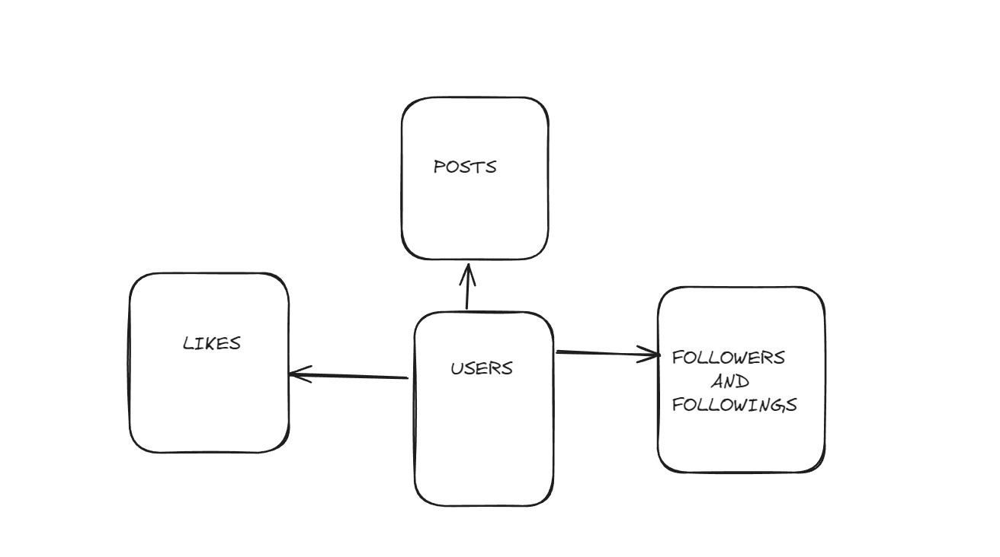
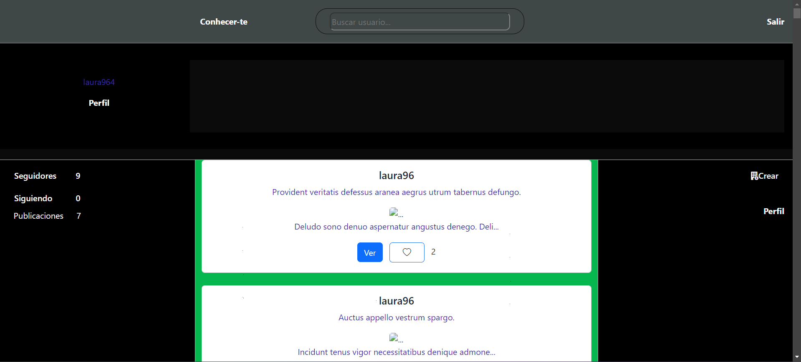
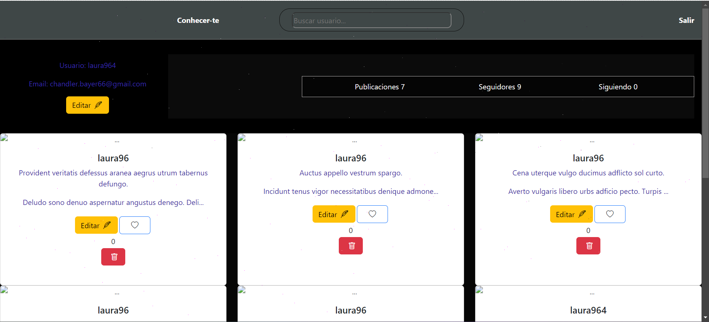
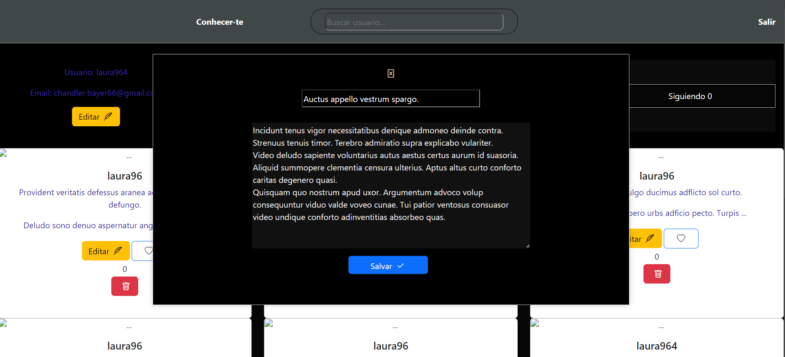

---

<ul>

<li><a href="#tecnologías">Technologies</a> </li>

<li> <a href="#urls">URLs</a> </li>

<li> <a href="#estructura-y-diseño-de-la-base-de-datos">Estructura y diseño de la base de datos</a> </li>

<li> <a href="#vista-de-la-aplicación">Vista de la Aplicación</a> </li>
<li> <a href="#futuras-funcionalidades">Futuras Funcionalidades</a></li>
<li> <a href="#author">Author</a> </li>

</ul>

---

## Technologies

---
## Description
El proyecto consiste en desarrollar una red social en la que se pueder registrarse, acceder a la red e interactuar con otros usuarios del sistema.

Para este repositorio se creara un app de parte del cliente que se conectara con la app del servidor.

Para esto se debe cumplir creando las funcionalidades de los siguientes rutas.

## URLs

Autenticación

| Método | URI | Acción | Extra |
| --- | --- | --- |---|
| POST | /api/auth/register | Registrar usuario |
| POST | /api/auth/login | Loguear usuario |

Usuarios

| Método | URI | Acción | Extra |
| --- | --- | --- |---|
| GET | /api/users | Listar todos los usuarios (super_admin) |
| GET | /api/users/profile | Modificar los datos del perfil |
| PUT | /api/users/profile | Actualizar datos del perfil |
| DELETE | /api/users/{id} | Delete user (super_admin)--- | Si |

Publicar

| Método | URI | Acción | Extra |
| --- | --- | --- |---|
| POST | /api/posts | Crear publicación |
| DELETE | /api/posts/{id} | Eliminar publicación por id |
| PUT | /api/posts | Actualizar publicación por id |
| GET | /api/posts/own | Recuperar mis publicaciones  |
| GET | /api/posts | Ver todos los posts |

Megusta

| Método | URI | Acción | Extra |
| --- | --- | --- |---|
| PUT | /api/posts/like/{id} | Dar megusta y eliminar me gusta |

Seguidores

| Método | URI | Acción | Extra |
| --- | --- | --- |---|
| GET | /users/following | Lista mis seguidores  | Si |
| GET | /users/followers | Lista usuarios que sigo  | Si |

El proyecto se encuentra en estado de construicción, a pesar de cumplir con todos los requisitos exigidos y algunos extras.

## Estructura y diseño de la base de datos

## Vista de la Aplicación

- Vista de regidtro

- Vista de login

- Vista Principal

- Vista de Perfil

- Vista de Editar Publicación

## Futuras Funcionalidades

Se crearán las funcionalidades de seguir y dejar de seguir un usuario, comentar las publicaciones, y subir imagenes. 

## Author:

Name: Miguel Bengui